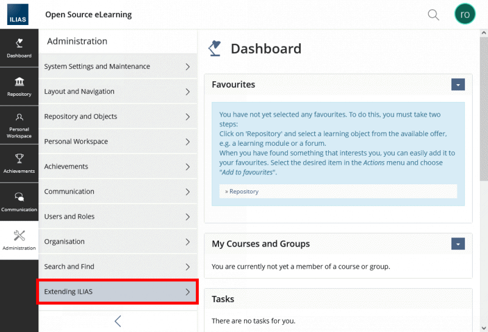

# MyUrlDisplay, _ILIAS Plugin_

A plugin for the opensource [ILIAS LMS](https://www.ilias.de/). It creates URL Configuration for each user that has in the dashboard.

## Prerequisites
- ILIAS version 8.0
- MySQL 5.7.x or MariaDB 10.2
- PHP 7.4-8.0
- Apache 2.4.x with mod_php

## How to install & test

- Install by unzip the directory in `<home_dir>/Customizing/global/plugins/Services/UIComponent/UserInterfaceHook`
- Make sure plugin directory is named `MyUrlDisplay`
- After having the right permissions and running `composer du`
- Install the plugin from **Administration** > **Extending ILIAS** > **Plugins** > **MyUrlDisplay**
- Go to **plugin** > **Configure**
- Update URL configurations, (hint: choose a bright color) then press **Save**
- Navigate back to the plugins page and activate the plugin
- Navigate to Dashboard, you should find a block on the right column with colored URL



### [MyUrlConfig](./docs/schemas/UrlConfig.json "UrlConfig") example response

```
{
  "id": 123,
  "userId": 321,
  "protocol": "https",
  "domain": "example.com",
  "port": 443,
  "path": "/dashboard/settings",
  "color": "#ff5733"
}
```

## Test Coverage

I didn't have the chance to use PHPUnit inside the framework, so only Unit tests for `src` directory were made. Integration tests are needed to test `src/Infrastructure/Data` classes.

To run the tests run the following commands after installing the plugin in the right directory
```
composer install --dev
libs/composer/vendor/bin/phpunit Customizing/global/plugins/Services/UIComponent/UserInterfaceHook/MyUrlDisplay/test
```

Results:

```
PHPUnit 9.6.22 by Sebastian Bergmann and contributors.
......................                          22 / 22 (100%)

Time: 00:00.747, Memory: 12.00 MB

OK (22 tests, 25 assertions)
```